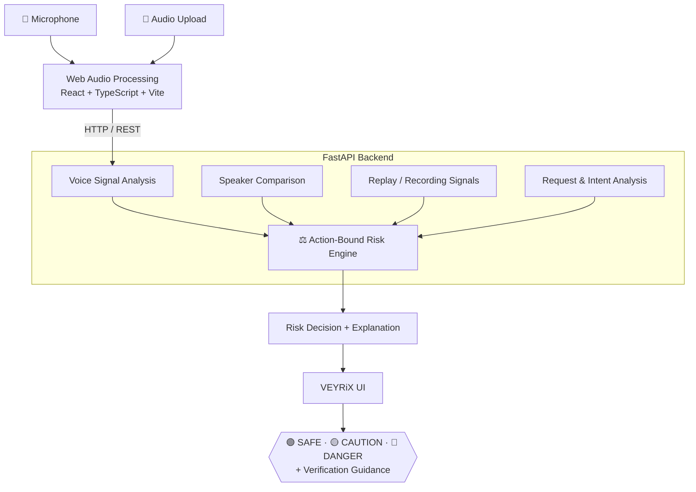

<div align="center">

# 🎙️ VEYRiX

### Voice Security. Before Trust.

**Never trust the voice alone. Check what they ask you to do.**

[](#-smart-india-hackathon-2026)
[](#-smart-india-hackathon-2026)
[](#-technology-stack)
[](#-technology-stack)
[](#-technology-stack)
[](#-technology-stack)
[](#-prototype-status)

### 🔗 [**Live Demo → veyrix-sih26104.netlify.app**](https://veyrix-sih26104.netlify.app/)

</div>

---

## 📌 At a Glance

| | |
|---|---|
| **What it is** | An AI-assisted voice security prototype that flags voice-impersonation scams **before** the user acts |
| **Core idea** | **Action-bound security**: assess *what the caller wants you to do*, not just *how the voice sounds* |
| **Output** | 🟢 SAFE · 🟡 CAUTION · 🔴 DANGER, with signals, explanation and verification guidance |
| **Who it protects** | Families, employees, bank customers, and anyone who takes phone calls |
| **Hackathon** | Smart India Hackathon 2026 · Problem Statement **SIH26104** |
| **Try it** | [Live demo](https://veyrix-sih26104.netlify.app/) · No sign-up needed |

---

## 🚨 The Problem

Voice cloning has made impersonation scams cheap, fast and convincing. A few seconds of audio can be enough to imitate someone the victim trusts.

The caller may sound like:

| Caller | Typical ask |
|---|---|
| 👨‍👩‍👧 A family member | "I'm in trouble, send money right now." |
| 💼 A manager | "Transfer this today. Keep it confidential." |
| 🏦 A bank officer | "Read me the OTP you just received." |
| 💻 An IT administrator | "Share your password so I can fix your account." |

**The voice can be perfect. The request is the giveaway.**

Most voice verification asks only one question: *"Who does this sound like?"*
Once a clone is good enough, that question stops being reliable on its own.

---

## 💡 Our Solution: Action-Bound Voice Security

VEYRiX asks two questions together:

```text
"Does this sound like someone I know?"        →  Voice Risk
                    +
"What are they asking me to do?"              →  Action Risk
                    ↓
        Better context to pause and verify
```

A convincing voice does not make a request trustworthy. A sensitive request raises the level of verification that voice should be held to.

### How VEYRiX differs from a voice-only approach

| | Voice-only detection | **VEYRiX (action-bound)** |
|---|---|---|
| Main question | Is this voice real or fake? | Is this voice **and this request** safe to act on? |
| Decision basis | One authenticity score | Fusion of several independent signals |
| Sensitive requests (money, OTP, password) | Not considered | **Raise the risk level** |
| Handles a very good clone | Can be fooled | Still catches the *behaviour* of a scam |
| Output to the user | A label | Signals, explanation and **what to do next** |
| Design stance | "Trust the model" | "Pause and verify independently" |

---

## 🎬 Demo Walkthrough (≈ 2 minutes)

> Open the **[live demo](https://veyrix-sih26104.netlify.app/)** and follow along.

| Step | Action | What to notice |
|---|---|---|
| **1** | **Record** with the microphone, or **upload** an audio file | Live waveform / oscillogram feedback during capture |
| **2** | **Run analysis** | Audio signals are extracted: pitch stability, zero-crossing rate, spectral characteristics, duration |
| **3** | **Review the signals** | Voice, speaker-comparison, replay and request signals are shown separately, not hidden in one number |
| **4** | **Read the risk level** | 🟢 SAFE / 🟡 CAUTION / 🔴 DANGER with the reasons behind it |
| **5** | **Follow the guidance** | Concrete steps: call back on a known number, never share OTPs, confirm through another channel |
| **6** | **Open history and report** | Previous checks, incident details, secondary verification workflow, printable forensic report preview |

**Suggested demo scenarios**

1. **Neutral request**: an ordinary conversation, low action sensitivity
2. **Family emergency**: urgent + money
3. **Bank OTP call**: authority + OTP
4. **Fake manager**: urgency + financial action + confidentiality
5. **Fake IT support**: password reset / new-device access

Watch how the **same kind of voice** can land at a different risk level depending on **what is being asked**.

---

## ✨ Key Features

### 🎙️ Voice Signal Analysis
Browser microphone recording and audio file upload, with extraction of pitch-related, zero-crossing and spectral characteristics plus a live waveform view.

### 🔍 Speaker Comparison
When a reference voice is available, the sample is compared against it. The result is a **supporting signal**, not proof of identity.

### 🔁 Replay & Recording Indicators
Looks for characteristics associated with audio that may be replayed, previously recorded, or captured from another source, rather than a normal live interaction.

### 🧠 Request & Intent Analysis
Detects context that raises the need for verification:

`💰 Money transfer` · `🔐 OTP sharing` · `🔑 Password request` · `⚡ Urgency` · `🤫 Secrecy` · `👤 Account / security change`

### ⚠️ Action-Bound Risk Engine
Fuses voice, speaker, replay, request and action-sensitivity signals into one assessment designed to make the user **pause before acting**.

### 📄 Incident History & Reports
Analysis history, incident details, a secondary verification workflow, and a printable forensic report preview.

---

## 🏗️ System Architecture



**Design principles**

- **Explainable by default**: every risk level ships with the signals that caused it
- **No single point of trust**: independent signals are combined, none is treated as ground truth
- **Human in the loop**: the system recommends verification, the user decides
- **Modular**: each signal engine can be upgraded or swapped without touching the rest

---

## 🔄 How It Works

1. **Capture**: record via microphone or upload audio, with real-time visual feedback
2. **Analyze voice signals**: pitch stability, zero-crossing rate, spectral characteristics, duration, waveform
3. **Compare the speaker**: compare against a reference voice when one is available
4. **Analyze the request**: urgency, money, OTP / password, secrecy, sensitive account actions
5. **Calculate risk**: combine *how suspicious the audio looks* with *how sensitive the requested action is*
6. **Recommend verification**: guide the user to confirm independently through a trusted channel

---

## 🎯 Scam Scenarios Covered

| Scenario | Signals combined | Guidance shown |
|---|---|---|
| 👨‍👩‍👧 **Family emergency** | Familiar voice + urgency + money request | Hang up and call the person back on a known number before sending money |
| 💼 **Fake manager** | Speaker uncertainty + urgency + financial action + confidentiality | Confirm through an official channel; secrecy is a red flag |
| 🏦 **Bank / OTP scam** | Authority claim + OTP request | Never share an OTP with a caller, however familiar they sound |
| 💻 **Fake IT support** | Password reset / new-device access request | Verify with the IT desk using a known contact |

---

## 🛡️ Risk Levels

| Level | Meaning |
|---|---|
| 🟢 **SAFE** | No major warning signals detected |
| 🟡 **CAUTION** | Some signals call for additional verification |
| 🔴 **DANGER** | Multiple warning signals detected, verify before doing anything |

> **A VEYRiX result is a security signal, not proof that a caller is genuine or fraudulent.**

---

## 🛠️ Technology Stack

| Layer | Technologies |
|---|---|
| **Frontend** | React 19 · TypeScript · Vite · Tailwind CSS · React Router |
| **Audio** | Web Audio API · Browser microphone APIs · Waveform / oscillogram visualization |
| **Backend** | Python · FastAPI · Uvicorn · Pydantic · REST APIs |
| **Deployment** | Netlify (frontend demo) · Vercel config included |

### 🔬 Proposed Production AI Architecture

The system is designed so neural pipelines can slot into each module:

| Module | Candidate technologies |
|---|---|
| Voice authenticity | AASIST · Wav2Vec2 / WavLM |
| Speaker verification | ECAPA-TDNN |
| Speech recognition | Whisper / Distil-Whisper |
| Voice embedding store | FAISS · ChromaDB · pgvector |
| Intent / coercion detection | NLP classifiers with policy-based risk rules |

> These integrations describe the **proposed production scope**. The current prototype does not deploy every listed model.

---

## 📊 Prototype Status

We are explicit about what is built and what is planned.

| Component | Status |
|---|---|
| Web interface | ✅ Working prototype |
| Microphone recording | ✅ Available |
| Audio upload | ✅ Available |
| Audio signal analysis | ✅ Available |
| Speaker comparison flow | ✅ Prototype |
| Replay / recording signals | ✅ Prototype |
| Request analysis | ✅ Prototype |
| Action-bound risk assessment | ✅ Available |
| Incident history | ✅ Available |
| Forensic report preview | ✅ Available |
| Advanced neural voice detection | 🔬 Proposed / production scope |
| Real-time telephony integration | 🔮 Future |
| Mobile / edge deployment | 🔮 Future |

---

## 🌍 Impact & Feasibility

**Who benefits**

- **Individuals & families**: protection from emergency and relative-in-distress scams
- **Employees & businesses**: a check against fake-executive and fake-vendor requests
- **Banks & fintech**: a verification prompt before OTP or transfer-related actions
- **Senior citizens & first-time digital users**: plain-language guidance instead of technical scores

**Why it is feasible**

- Runs as a web app: no installation, works on any modern browser with a microphone
- Modular backend: each signal engine can be improved independently
- Action-bound logic keeps working even as voice cloning improves, because it looks at the *request*, not only the *audio artefacts*
- Clear path from prototype → streaming → telephony → banking integration

---

## 🔮 Roadmap

| Phase | Focus |
|---|---|
| **Now** | Prototype: capture, signal analysis, action-bound risk, history and reports |
| **Next** | Integrate neural models: AASIST, ECAPA-TDNN, Whisper |
| **Then** | Streaming analysis with continuous risk updates during a live call |
| **Scale** | Telephony (VoIP / SIP / Asterisk / FreeSWITCH) and call-centre integration |
| **Reach** | Indian-language support: Hindi, Marathi, Tamil, Bengali and dialects |
| **Deploy** | Lightweight on-device inference for mobile · banking workflow integration |

```text
Live Call → Streaming Audio → Real-Time STT → Voice Analysis → Request Analysis → Continuous Risk Update
```

---

## 🚀 Getting Started

### Prerequisites

- Node.js ≥ 18 and npm
- *(Optional, for the backend)* Python ≥ 3.10

### 1. Clone

```bash
git clone https://github.com/DishaB-07/VEYRiX.git
cd VEYRiX
```

### 2. Install frontend dependencies

```bash
npm install
```

### 3. Configure environment

```bash
cp .env.example .env
```

To connect to a local FastAPI backend:

```env
VITE_API_BASE_URL=http://localhost:8000
```

### 4. Run the frontend

```bash
npm run dev
```

Available at `http://localhost:3000`.

### 5. (Optional) Run the backend

```bash
cd backend
python -m venv .venv

# Windows
.venv\Scripts\activate
# macOS / Linux
source .venv/bin/activate

pip install -r requirements.txt
uvicorn app.main:app --host 0.0.0.0 --port 8000 --reload
```

Interactive API docs: `http://localhost:8000/docs`

---

## 🔌 API Reference

| Method | Endpoint | Purpose |
|---|---|---|
| `GET` | `/api/v1/health` | Service health |
| `POST` | `/api/v1/analyze` | Full voice + action risk analysis |
| `POST` | `/api/v1/voice/verify` | Speaker comparison |
| `POST` | `/api/v1/intent/analyze` | Request / intent analysis |
| `POST` | `/api/v1/risk/evaluate` | Action-bound risk evaluation |
| `GET` | `/api/v1/incidents` | Incident history |
| `GET` | `/api/v1/incidents/{id}` | Single incident details |

---

## 🧪 Testing

```bash
python backend/tests/test_health.py
python backend/tests/test_analysis.py
python backend/tests/test_risk.py
```

**Primary user flow to verify before any demo:**

`Open VEYRiX → Record / Upload → Run Analysis → Review Signals → Review Risk → Follow Guidance`

---

## 📂 Project Structure

```text
VEYRiX/
│
├── Frontend/
│   ├── src/
│   │   ├── components/
│   │   ├── views/
│   │   ├── services/
│   │   ├── utils/
│   │   ├── data/
│   │   └── ...
│   ├── .env.example
│   ├── index.html
│   ├── package.json
│   ├── tsconfig.json
│   ├── vite.config.ts
│   └── vercel.json
│
├── backend/
│   ├── app/
│   │   ├── api/
│   │   ├── core/
│   │   ├── models/
│   │   ├── schemas/
│   │   ├── services/
│   │   └── utils/
│   ├── tests/
│   ├── .env.example
│   ├── requirements.txt
│   └── README.md
│
└── README.md
```

---

## 🔐 Security & Privacy

- **Secrets**: API keys are never committed; configuration uses environment variables; `.env` stays out of version control
- **Audio**: designed to avoid unnecessary permanent audio retention. Actual behaviour depends on the deployment and connected services
- **Production hardening**: restricted CORS origins, HTTPS, authentication where required, request validation, controlled logging

---

## 🎓 Smart India Hackathon 2026

**Problem Statement: SIH26104**
*AI-Powered Real-Time Detection and Prevention of Voice Cloning Impersonation Attacks*

VEYRiX addresses this by treating voice authenticity **together with the action requested**, helping users recognise suspicious interactions before they:

- 💸 Transfer money
- 🔐 Share OTPs
- 🔑 Reveal passwords
- ⚙️ Change account settings
- ⚠️ Perform other sensitive actions

---

## 👥 Team

| Name | Role |
|---|---|
| **Team Name** | *Add team name* |
| [Disha B](https://github.com/DishaB-07) | *Add role* |
| *Member 2* | *Add role* |
| *Member 3* | *Add role* |
| *Member 4* | *Add role* |
| *Member 5* | *Add role* |
| *Member 6* | *Add role* |

**Mentor:** *Add mentor name*  ·  **Institution:** *Add institution*

---

## ⚠️ Disclaimer

VEYRiX is a research and hackathon prototype. Its results are **security signals, not definitive proof of identity, authenticity or fraud**. For any request involving money, OTPs, passwords or account access, always verify the caller independently through a trusted channel.

---

<div align="center">

### VEYRiX: Voice Security. Before Trust.

**Smart India Hackathon 2026 · SIH26104**

*Built to help people pause, verify, and act safely.*

🔗 [Live Demo](https://veyrix-sih26104.netlify.app/) · 💻 [GitHub](https://github.com/DishaB-07/VEYRiX)

</div>
